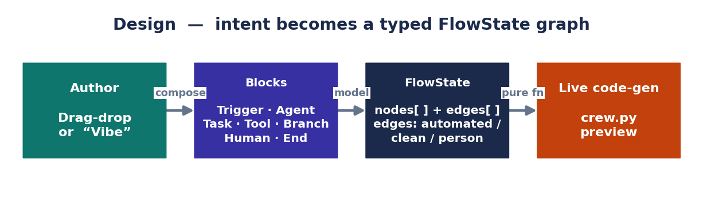
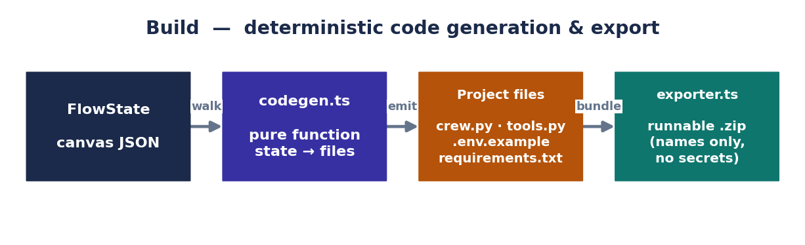
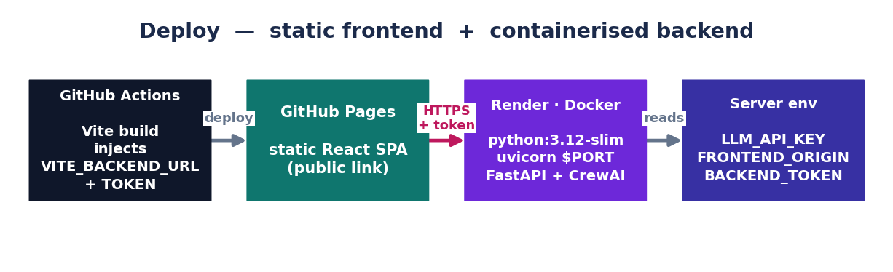
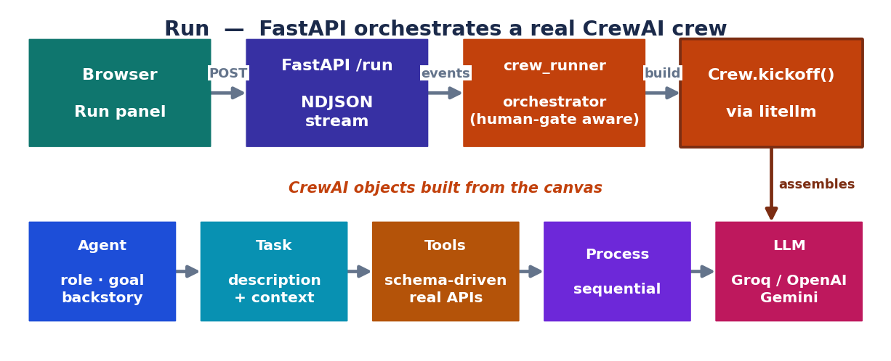

# Visual Agent Builder

### Architecture & Technical Reference — Design · Build · Deploy · Run

A drag-and-drop, AI-assisted composer for **CrewAI** automations.
React + TypeScript frontend (GitHub Pages) · FastAPI + CrewAI backend (Render/Docker) · litellm multi-provider routing.

**Live app:** https://ratnadipsinha.github.io/CREWAI/ · **Deploy your own:** [`SETUP.md`](SETUP.md)

---

## Overview

Visual Agent Builder lets anyone compose a multi-agent CrewAI automation on a visual canvas,
watch the equivalent Python generate live, test tool credentials, run the crew for real with
streamed step output, and either export a runnable project or schedule recurring headless runs.
The system is organised into four stages that map onto the lifecycle of an automation:
**Design, Build, Deploy, and Run.**

> The canvas **FlowState** is the single source of truth. The generated code, the live run, the
> exported project, and the scheduled job are all deterministic functions of that same graph, so
> what you see on the canvas is exactly what executes.

---

## Chapter 1 — Design

Design is where a human expresses intent. The user assembles blocks on a canvas (or describes the
idea in plain English via *"Vibe your idea,"* which generates the canvas), and the app maintains a
typed graph that drives every other stage.



*Figure 1 — Canvas blocks and edges compile into a typed FlowState graph.*

### The data model (`types.ts`)

The canvas is a graph of seven block types, persisted as a FlowState of nodes and edges:

- **Trigger** — starts the run (manual / scheduled / event).
- **Agent** — role, goal, backstory, and a list of attached tool keys.
- **Task** — description, expected output, and the agent that runs it.
- **Tool** — a connector reference (`toolKey`); an attachment to an agent, not an execution step.
- **Branch** — a routing condition (becomes a CrewAI `@router`).
- **Human** — an approval gate with a prompt.
- **End** — terminal node.

Edges carry a semantic colour — automated (purple), clean (green), or person (pink) — preserved
through code generation so the routing intent survives into the generated Flow.

```ts
interface FlowState { nodes: Node[]; edges: Edge[]; }
type EdgeKind = "automated" | "clean" | "person";
```

### Assisted design

- **Vibe your idea** — a plain-English prompt is expanded into a full canvas.
- **Live code-gen** — `codegen.ts` re-runs on every change (memoised); the CodePanel always mirrors the canvas.
- **Credential modals** — attaching a Tool block opens a schema-driven modal for only that tool's fields, with a **Test login** button that validates against the backend.

---

## Chapter 2 — Build

Build turns the visual graph into real, runnable CrewAI source. Code generation is a pure,
deterministic function of FlowState — identical input always yields identical output, with no LLM
involved — so the generated project is reproducible and reviewable.



*Figure 2 — codegen.ts deterministically emits a runnable CrewAI project; exporter.ts zips it.*

### Code generation (`codegen.ts`)

The generator walks the graph and emits a small, conventional CrewAI project:

- **`crew.py`** — Agent / Task / Crew objects in topological run order; Branch nodes become `@router` and Human nodes become approval points.
- **`tools.py`** — one tool instance per used connector, reading credentials from environment variables.
- **`.env.example`** — the names of every required credential (values never written).
- **`requirements.txt`** — `crewai`, `crewai-tools`, `litellm`, and connector dependencies.

Graph resolution is centralised so the browser preview, the exported project, and the live backend
agree on run order, which agent runs each task, and which tools attach to an agent (`codegen.ts`
mirrors the backend's `flow_graph.py`).

### Export (`exporter.ts`)

- Bundles the generated files into a project `.zip` named after the canvas.
- Includes scheduling installers: `register_task.bat` / `unregister_task.bat` (Windows) and `install_schedule.sh` (cron), naming the OS job `Agent-<project name>`.
- Ships `.env.example` only — no secret value is ever serialised into the bundle.

---

## Chapter 3 — Deploy

Deploy covers hosting: a static React SPA on GitHub Pages and a containerised FastAPI + CrewAI
backend on Render. The split keeps the frontend free to host and the Python execution environment
isolated in Docker.



*Figure 3 — Frontend builds on GitHub Actions to Pages; backend runs as a Render Docker service.*

### Frontend — GitHub Pages

- GitHub Actions builds the Vite SPA and publishes to Pages.
- `VITE_BACKEND_URL` is injected at build time from a repo Actions variable (not committed); if omitted, the user can paste the backend URL at runtime in Settings.
- `VITE_BACKEND_TOKEN` is injected the same way so the deployed frontend can call a protected backend.

### Backend — Render (Docker)

- `Dockerfile` builds `python:3.12-slim` and runs uvicorn on `$PORT`.
- `render.yaml` is a Blueprint; `LLM_API_KEY` and `FRONTEND_ORIGIN` are dashboard env vars (`sync:false`).
- CORS is driven by `FRONTEND_ORIGIN` (comma-separated list, or `*` to test).

**Security posture**

- No secrets are committed; `.env.local` and `backend/.env` are gitignored.
- Tool credentials are sent per-run in the request body and never persisted server-side.
- Optional `BACKEND_TOKEN` enforces an `X-API-Token` header on protected endpoints; `/health` and `/version` stay open. It is backward-compatible — enforced only when both sides set the token.

---

## Chapter 4 — Run (with CrewAI)

Run is where the canvas executes for real. The browser streams a run request to FastAPI, which
orchestrates a genuine CrewAI crew — real Agents, real Tasks, a real LLM, and real tools — and
streams each step back as NDJSON so the Run panel updates live.



*Figure 4 — The backend builds and kicks off a real CrewAI crew, streaming each step to the browser.*

### Request & streaming (`server.py`)

The browser POSTs `{ flow, credentials, llm }` to `/run`. The endpoint assigns a `run_id`, then
returns a `StreamingResponse` of `application/x-ndjson` — one JSON event per line:

```
{"type":"run","run_id":"..."}            run started
{"type":"tools","tools":[...]}           tool readiness
{"type":"step","id":"2.0","status":"running|done|await|halted"}
{"type":"done","summary":"..."}          final result
```

- `crewai` is imported lazily inside `/run`, so the server (and `/health`) boot fast.
- Human gates use asyncio Futures in a per-run `_pending` map; `/approve` resolves them.

### Orchestration (`crew_runner.py`)

`crew_runner` walks the flow in run order and chooses one of two execution paths:

- **No human gate → fast path:** a single real multi-task `Crew.kickoff()` with true CrewAI process semantics; a `task_callback` fires as each task completes and is streamed immediately.
- **Has a human gate → segmented path:** tasks run one-by-one so the run can pause at the gate; on rejection the run halts and no downstream actions are taken.

### Building the crew (`crew_factory.py`)

Real CrewAI objects are constructed directly from the canvas:

```python
Agent(role, goal, backstory, tools=[...], llm=llm)
Task(description, expected_output, agent=agent)
Crew(agents=[...], tasks=[...], process=Process.sequential,
     task_callback=stream_cb)
```

- `resolve_agent` picks the agent for a task (Agent→Task edge, then any link, then stored `agentId`).
- `tools_for_agent` builds real tool instances for each wired Tool block from its auth schema + credentials.
- In the full-crew path the Crew passes task context automatically; the segmented path threads it manually.

### The LLM (`llm_factory.py` + litellm)

- `make_llm` trusts browser LLM settings only when they point at a real `http(s)` endpoint with a key (the *"Custom API"* engine); otherwise it falls back to backend env (`LLM_BASE_URL` / `LLM_MODEL` / `LLM_API_KEY`).
- Models route through litellm's OpenAI-compatible handler (`openai/<model>` + `base_url`); the native `groq/` provider is deliberately avoided.
- CrewAI injects an Anthropic-style prompt-cache breakpoint that Groq rejects; `llm_factory` patches `litellm.completion` to recursively scrub `cache_control` / `cache_breakpoint` from messages, and sets `drop_params` / `modify_params`.

### Tools at runtime (`tools_registry.py` · `tool_schema.py`)

A single dependency-light schema (`tool_schema.py`) is the source of truth for each tool's auth
type and credential field names — shared by the registry (which builds tools) and the `/test-tool`
endpoint (which validates credentials). Supported connectors:

- **Outlook** — app-only Microsoft Graph (client credentials).
- **Gmail** — OAuth refresh-token flow.
- **Jira** (basic) · **HubSpot** (API key) · **NetSuite** (token).
- **MCP Server** — a generic connector to ANY MCP server by URL, no per-service code (`MCPServerAdapter`).

### Scheduling (`scheduler.py`)

- `/schedule` registers a recurring run via APScheduler (`CronTrigger.from_crontab`); jobs run headless and auto-approve human gates.
- `/schedules` lists jobs; `DELETE /schedule/{id}` removes them.

---

## Summary

The four stages share one graph and one set of resolution rules. **Design** captures intent as a
typed FlowState; **Build** compiles it deterministically into CrewAI source; **Deploy** hosts the
SPA and the containerised engine with credentials kept out of source control; and **Run** executes
the same graph as a real CrewAI crew, streaming each step back to the browser. Because every stage
is driven by the same FlowState, the preview, the export, and the live run stay consistent.

---

## Run locally

```bash
cd code
npm install
npm run dev        # http://localhost:3000
```

Backend locally:

```bash
cd code/backend
python -m venv .venv && .venv/Scripts/activate   # macOS/Linux: source .venv/bin/activate
pip install -r requirements.txt
cp .env.example .env   # set LLM_API_KEY etc.
python server.py       # http://localhost:8000
```

See [`SETUP.md`](SETUP.md) to deploy your own copy.
