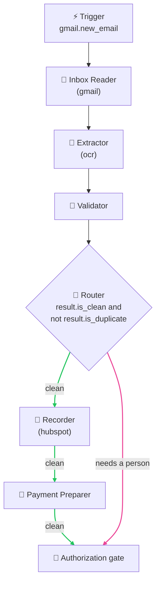
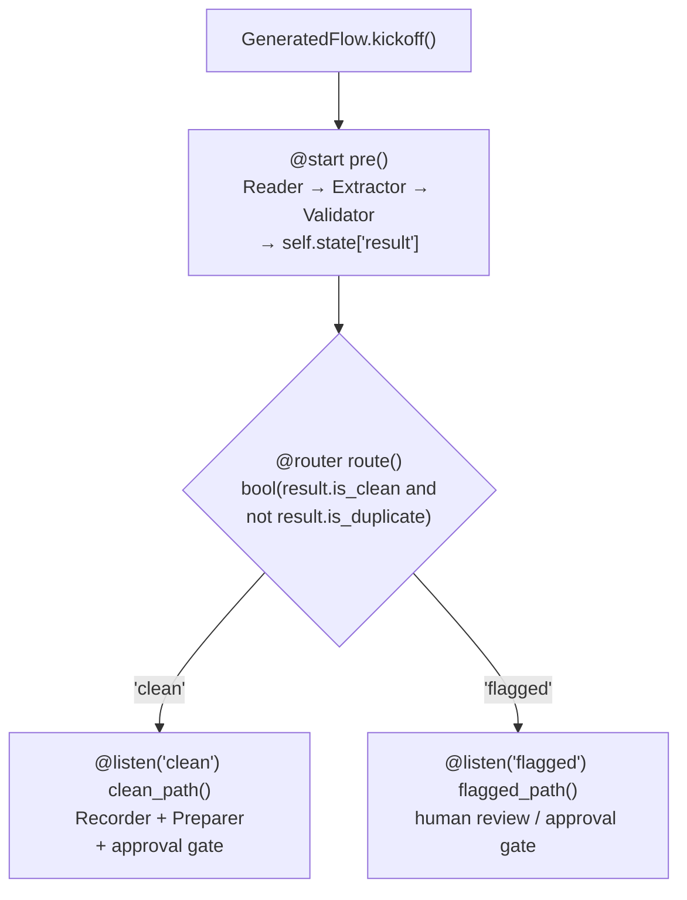

# Branch Flow Example — Invoice-to-Approval (AP automation)

How a canvas with a **Branch** block maps to a generated CrewAI `Flow`
(`@start` → `@router` → `@listen`). Connector colors drive routing:
green = clean path, pink = needs a person.

## Canvas graph



## Generated execution (CrewAI Flow)



## Mapping

| Canvas | Generated Flow |
|--------|----------------|
| Nodes upstream of the Router | `@start pre()` sub-crew |
| Router `condition` | `@router route()` → returns `"clean"` / `"flagged"` |
| green (clean) edges from Router | `@listen("clean") clean_path()` |
| pink (person) edges from Router | `@listen("flagged") flagged_path()` |
| Human gate on a path | `input("Approve? [y/N]")` block inside that path |

Generated `crew.py` (excerpt):

```python
class GeneratedFlow(Flow):
    @start()
    def pre(self):
        result = _crew([reader, extractor, validator], [t_read, t_extract, t_validate]).kickoff()
        self.state['result'] = result
        return result

    @router(pre)
    def route(self):
        result = self.state.get('result')
        try:
            decision = bool(result.is_clean and not result.is_duplicate)
        except Exception:
            decision = True
        return "clean" if decision else "flagged"

    @listen("clean")
    def clean_path(self):
        result = _crew([recorder, preparer], [t_record, t_prepare]).kickoff()
        print("Require a person to approve before paying.")
        if input("Approve? [y/N] ").strip().lower() != "y":
            return "Halted: not approved by human."
        return result

    @listen("flagged")
    def flagged_path(self):
        print("Require a person to approve before paying.")
        if input("Approve? [y/N] ").strip().lower() != "y":
            return "Halted: not approved by human."
        return None
```
